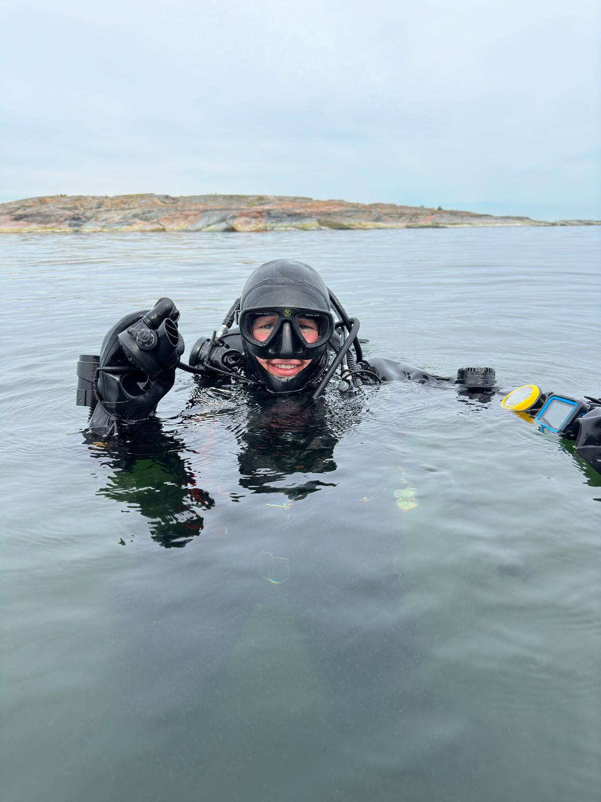

# Educational and professional background

## Concurrent university studies, annual fieldwork at sea, and one year of scientific diving training
I studied physical geography at the University of Helsinki, focusing on marine areas, geoinformatics, and remote sensing. My Bachelor's thesis focused on assessing the efficiency of remote sensing methods for mapping macroalgae growing underwater. During my Master's studies in 2019, I began conducting marine biodiversity inventories for Metsähallitus in the Bothnian Bay. In spring 2020, I started my Master's thesis at the Finnish Environment Institute (SYKE) using machine learning species distribution modelling to study future changes in the distribution of a key habitat-forming species in the Baltic Sea under different eutrophication and climate change scenarios. Following my work at SYKE, I continued conducting underwater inventories for Metsähallitus in the Gulf of Finland. In summer 2021, before graduation, I worked at Alleco with similar tasks. In 2022, while completing my Master’s thesis, I began a year-long vocational qualification program in Luksia to become a professional scientific diver. I completed my thesis during this training and graduated twice in 2022: first with a Master of Science and later as a certified Scientific Diver.

## Postgraduate experience: marine environmental consulting, scientific diving and PhD research
After graduation, I started working as an environmental expert at AFRY. My main tasks included writing environmental impact assessments for offshore wind power projects, focusing on impacts on underwater habitats. I also worked as a coordinator on an offshore wind power project EIA and as a stream lead in a project commissioned by the Finnish Government (Valtioneuvosto), where we assessed the possibilities to increase offshore wind power in Finland efficiently and sustainably. During my time at AFRY, I also spent summers working as a scientific diver at Alleco. In 2025, I decided to pursue my long-term dream of working as a scientist in marine biology and started a PhD at Åbo Akademi University. I was awarded full funding for my own four-year PhD project on the impacts of offshore wind power on underwater habitats, as well as for a three-year PhD project on ship traffic effects. I chose to pursue the latter, which offered a larger collaborative research environment as part of the Digital Waters Flagship Consortium. My PhD has been an incredibly rewarding experience: spending a five-month field season living on an island in the Archipelago Sea, conducting hands-on marine research, honing my coding and data analysis skills, and generating exciting results, all while contributing to work that is ecologically important. 
